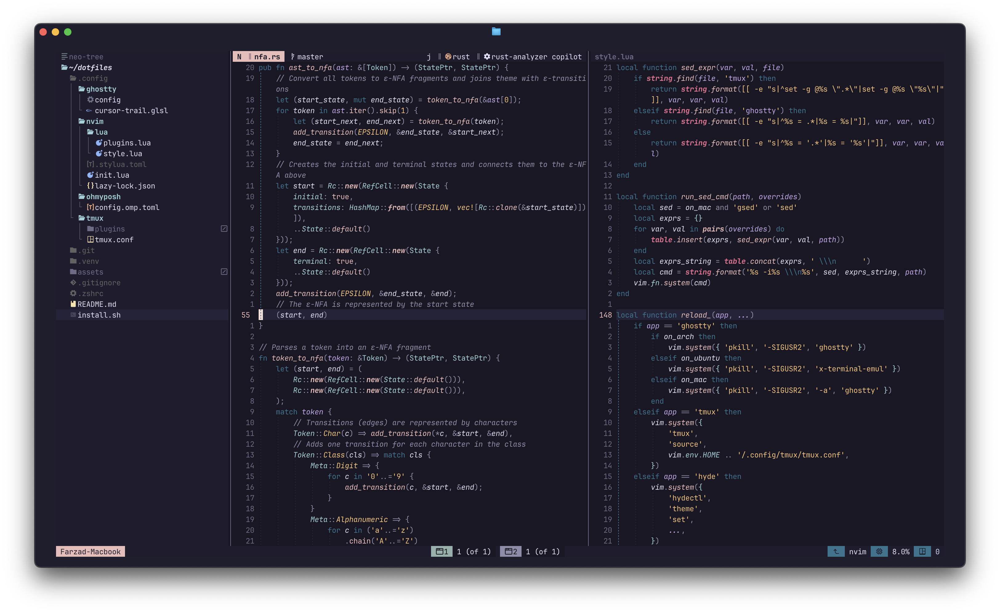
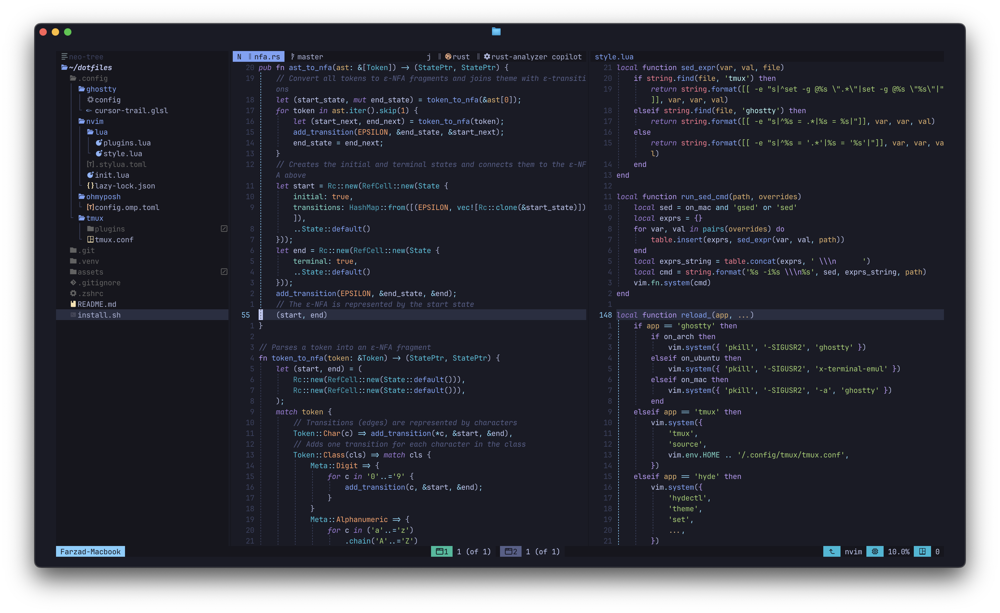
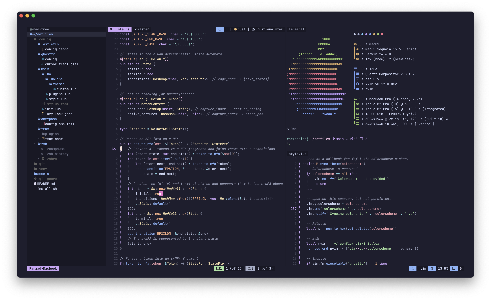
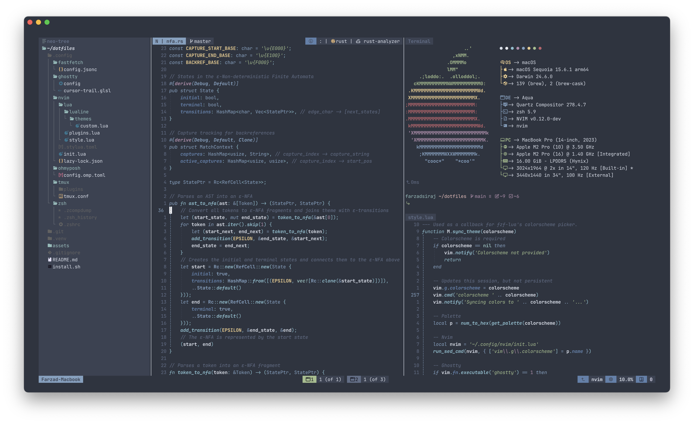

# ✨ Minimal, Fast, Beautiful

> A carefully crafted development environment that just works (most of the time)

<details open>
<summary><strong>🌹 Rosé Pine</strong> - All natural pine, faux fur and a bit of soho vibes</summary>



</details>

<details>
<summary><strong>🌙 Tokyo Night</strong> - Dark theme inspired by Tokyo's neon lights</summary>



</details>

<details>
<summary><strong>☕ Catppuccin Mocha</strong> - Soothing pastel theme</summary>



</details>

<details>
<summary><strong>❄️ Nord</strong> - Arctic, north-bluish color palette</summary>



</details>

## 🚀 Quick Start

> **Supported Systems:** macOS • Ubuntu • Arch Linux

```bash
curl -fsSL https://raw.githubusercontent.com/fsiraj/dotfiles/main/install.sh | sh
```

## 🛠️ What's Included

> Only reputable actively maintained tools, packages, and plugins

#### 💻 **Terminal & Shell**

> - **Terminal:** [Ghostty](https://ghostty.org/) - Lightning fast GPU-accelerated terminal
> - **Shell:** [ZSH](https://www.zsh.org/) with modern enhancements
>   - **Plugin Manager:** [zinit](https://github.com/zdharma-continuum/zinit) - Turbo-charged plugin loading
> - **Prompt:** [Oh My Posh](https://ohmyposh.dev/) - Beautiful, customizable prompt

#### ⚡ **Development**

> - **Editor:** [Neovim](https://neovim.io/) - The hyperextensible Vim-based text editor
>   - **Plugin Manager:** [Lazy](https://github.com/folke/lazy.nvim) - Modern plugin manager
> - **Multiplexing:** [tmux](https://github.com/tmux/tmux) - Terminal workspace management
> - **Plugin Manager:** [tpm](https://github.com/tmux-plugins/tpm) - Tmux plugin manager

#### 🎨 **Theming**

> - **Font:** [JetBrainsMono Nerd Font](https://github.com/ryanoasis/nerd-fonts/tree/master/patched-fonts/JetBrainsMono) - Perfect for coding
> - **Default Theme:** [Rosé Pine](https://rosepinetheme.com/) - All natural pine, faux fur and a bit of soho vibes

## 🌈 Theme System

> Works perfectly for the 4 themes (and their variants) showcased above

**Synchronized theming across all applications!**

> Switch themes instantly using fzf-lua's colorscheme picker - <kbd>\<Leader\>sc</kbd> - in Neovim, and watch as the entire development environment adapts seamlessly.

**Want to add more themes?**

> Add it to `style.lua` using any existing theme as a template. At a minimum, add an entry to `get_palette`. If using ghostty, ensure the theme is available (and can be found) with `get_ghostty_theme`. If using Arch with HyDE, ensure the theme is available and add an entry to `get_hyde_theme`.

---

<div align="center">

**Happy coding!** 🎉

</div>
